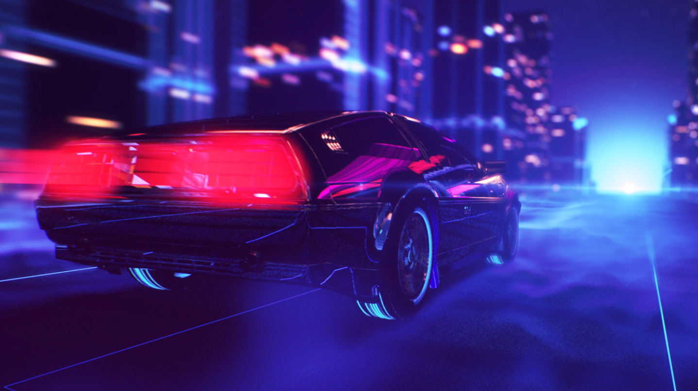

# Конкурс №137 "Race III"

Темой 137 конкурса становятся гонки.

Очень. Крутые. Гонки.

Давненько их не было, а ведь история богатая.

Все очень просто - нам нужны лишь машины и скорость.

**Основные условия:**

- управляемый игроком транспорт.
- управляемые компьютером соперники.
- скорость.

Естественно гонки не обязательно должны быть на машинах, подойдет любое транспортное средство.

**Бонусные условия:**

- Таблица рекордов. Родина должна знать своих героев. Будет принята онлайн реализация таблицы рекордов, но сама игра все равно должна работать без интернета.
- Разнообразие. Будем считать очень просто - количество разных трасс, машин или режимов игры должно быть больше семи - в любом порядке, 3 вида машинок и 4 трассы нас вполне устроят.
- Стиль. Самое противоречивое условие конкурса, но и самое понятное. Нам нужны дым, неон, крутые тачки, черные очки и прочие виды крутости. Нам нужно, чтобы ваша игра выглядела круто хотя бы в части аспектов. Критерии наступления этого пункта, ввиду своей размытости, будет вынесены на обсуждение отдельно.

Конкурс продлится по 14 сентября включительно, ограничения на размер сборки - 60 Мб. Как всегда, концепты и работы можно и нужно обсуждать на форуме, это же поможет разобраться с последним нечетким пунктом бонусных условий.
